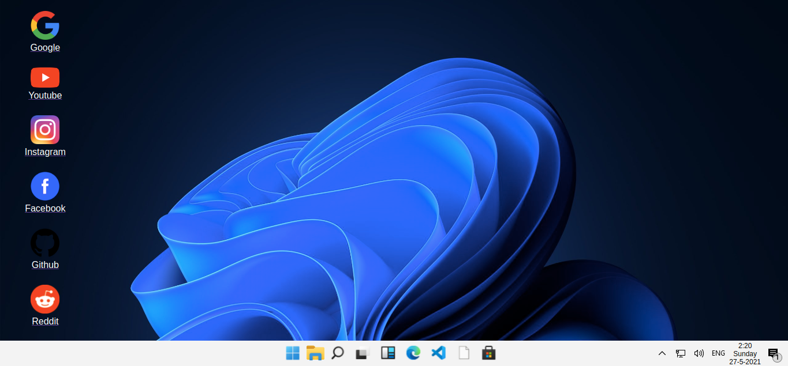

# Windows 11
Check it out [here][link]

 

### Languages that are used:

 
 

### Description:
This HTML CSS JS project is created by Codewithharry a youtuber I add some modification.

### Other:
if you have any other idea to add in this project you can folk it and make more interactive.

[link]:https://relaxed-brahmagupta-4ba40e.netlify.app/
